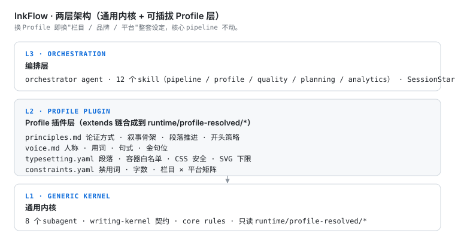
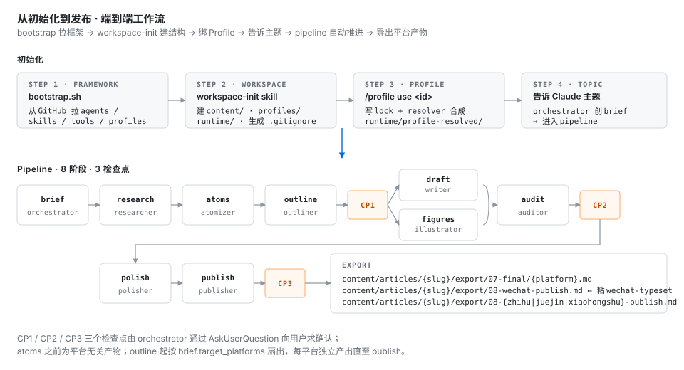
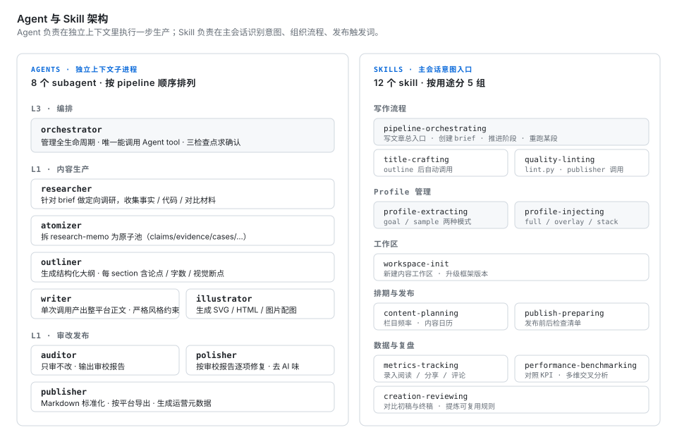

# InkFlow · 墨流

> **通用写作内核 + 可插拔 Profile 层**
> 基于 Claude Code 原生能力（subagent / skill / hook / memory）的 LLM 辅助内容创作工作流框架。
> 换 Profile 即换"栏目 / 品牌 / 平台"整套设定，核心 pipeline 不动。

当前版本：见 [`VERSION`](VERSION) 文件 ｜ 默认工作语言：中文

---

## 为什么做 InkFlow

LLM 写文章的两个老问题：

1. **风格漂移** — 一套 prompt 适配所有栏目，最终谁都不像；换栏目就得重写 agent。
2. **上下文污染** — 调研素材 / 排版规则 / 风格指南全挤进一个上下文，写作质量随文章长度衰减。

InkFlow 的解法：

- **通用内核保持稳定**：agent 不感知栏目 / 品牌 / 平台，只读一份 resolved 产物。
- **Profile 层承载所有变体**：四类 slot 声明式定义"怎么写"，extends 链支持层层叠加（基座 → 平台 → 品牌）。
- **独立上下文执行**：每个 subagent 在独立上下文跑一步生产，互不干扰。
- **检查点驱动**：orchestrator 在 CP1/CP2/CP3 向用户求确认，AI 生成的是可判断的产出物，不是 yes/no 问题。

---

## 两层架构

<p align="center">
  
</p>

- **L3 编排层**：orchestrator agent + 12 个 skill + SessionStart hook。主会话意图识别、pipeline 调度、Profile 自动刷新。
- **L2 Profile 插件层**：四类 slot（principles / voice / typesetting / constraints）。支持 `extends` 链合成，合成产物落到 `runtime/profile-resolved/*`。
- **L1 通用内核**：8 个 subagent + writing-kernel 契约 + core rules。**只读** `runtime/profile-resolved/*`，不感知具体栏目 / 品牌 / 平台。

### 设计哲学

1. **交接协议原则** — 每次交给用户的是可判断的产出物，不是 yes/no 问题。
2. **上下文隔离原则** — 每个阶段独立 subagent，避免调研噪音污染写作上下文。
3. **审改分离原则** — 审校和润色由不同 agent 独立执行，裁判不下场。
4. **插件层隔离原则** — 栏目 / 品牌 / 平台设定全部沉淀到 Profile 包，通用内核不感知。
5. **契约驱动原则** — 每个 agent 有明确的输入 / 输出契约和完成标准。
6. **声明式流水线原则** — pipeline 通过 YAML 清单定义，stages 可重跑可恢复。

---

## 从初始化到发布 · 端到端工作流

<p align="center">
  
</p>

### 初始化（四步）

```bash
# 1. 拉框架文件（agents / skills / tools / profiles / contracts）
bash framework/tools/bootstrap.sh . https://github.com/lync-cyber/Ink-Flow

# 2. 创建项目结构（content/ · profiles/ · runtime/ · .gitignore）
#    在 Claude Code 中说："初始化工作区" 触发 workspace-init skill

# 3. 绑定一个 Profile
python framework/tools/inject_profile.py set-active lync-wechat-tech
# 或在 Claude Code 中：/profile use lync-wechat-tech
# SessionStart hook 会在下次会话开始时自动刷新 runtime/profile-resolved/*

# 4. 告诉 Claude 主题即可启动 pipeline
#    "写一篇关于 X 的文章" → orchestrator 创建 brief → 进入 8 阶段流水线
```

### Pipeline · 8 阶段 · 3 检查点

```
brief → research → atoms → outline [CP1] → draft ∥ figures → audit → polish [CP2] → publish [CP3]
```

| 阶段 | 产物 | 负责 agent |
|---|---|---|
| brief | `01-brief.md` | orchestrator |
| research | `02-research-memo.md` | researcher |
| atoms | `02-atoms/*.md` | atomizer |
| outline | `03-outline/{platform}.md` | outliner |
| draft | `04a-draft/{platform}/section-NN.md` → `merged-draft.md` | writer |
| figures | `04b-figure/{platform}/*.png` + `figure-index.md` | illustrator |
| audit | `05-audit/{platform}.md` | auditor |
| polish | `06-polish/{platform}.md` | polisher |
| publish | `07-final/{platform}.md` + `08-{platform}-publish.md` | publisher |

- **atoms 之前**：平台无关的共用产物
- **outline 起按 brief.target_platforms 扇出**：每平台独立产出直至 publish
- **三个检查点**：CP1（大纲）· CP2（审校）· CP3（发布前），通过 `AskUserQuestion` 向用户求确认

---

## Agent 与 Skill 架构

<p align="center">
  
</p>

**Agent 与 Skill 的分工**：

- **Agent** 运行在独立上下文子进程里，执行一步生产。orchestrator 是唯一能调用 Agent tool 的角色；其余 agent 由 orchestrator 派发。agent frontmatter 的 `profileSlots` 字段声明依赖的 slot，`dependencies.resolved` 指向 `runtime/profile-resolved/*`。
- **Skill** 运行在主会话上下文里，负责意图识别、流程组织、触发词发布。skill 的 `description` 字段里写好触发条件，用户自然语言提及时 Claude 自动加载。

---

## 目录结构

```
.claude/
  agents/                  # 8 个 subagent + orchestrator 子模块
  skills/                  # 12 个 skill
  rules/core/              # 通用写作规范（与 Profile 无关）
  settings.json            # SessionStart hook 自动刷新 profile-resolved

profiles/                  # Profile 插件包
  base-generic-chinese/    # 通用中文基座（任何 Profile 都应 extends）
  platform-wechat/         # 微信平台契约（25 容器 + CSS 安全 + 行内扩展）
  lync-wechat-tech/        # 示例：作者 Lync 的微信四栏目 Profile

framework/
  config/
    inkflow.yaml           # Pipeline manifest（stages 声明）
    artifact-layout.yaml   # 产物路径模板
    platform-lint-rules.yaml
  contracts/
    profile-protocol.md    # Profile 协议 + merge 规则 + lock 机制
    profile.schema.json    # Profile manifest JSON Schema
    writing-kernel.md      # 平台无关写作元契约
    wechat-typeset.schema.json
  tools/
    bootstrap.sh           # 框架拉取 / 升级
    profile_resolver.py    # extends 展开 + slot 合成
    inject_profile.py      # 绑定 / 查询 / overlay / stack
    validate_profile.py    # schema 校验
    _adapters/             # 外部排版工具适配器

runtime/
  profile-lock.yaml        # 当前绑定的 Profile id
  profile-resolved/        # 合成产物（所有 agent 的唯一读源）
  pipeline-states/         # pipeline 运行状态
  typeset-capabilities.json

content/                   # 创作资产（纳入版本管理）
  articles/{slug}/         # 文章产物
  references/articles/     # 外部参考文章
  retrospectives/          # 运营数据 / 复盘日志
```

---

## Profile 使用

### 三种注入模式

| 模式 | 命令 | 作用域 |
|---|---|---|
| full | `/profile use <id>` | 整个工作区持久生效 |
| overlay | `/profile overlay <id>@<stage>` | 单篇文章某些阶段 |
| stack | `/profile stack A+B+C` | 临时虚拟组合，不落盘 |

### 四类 slot

| slot | 内容 | 形态 |
|---|---|---|
| `principles` | 论证方式 · 叙事骨架 · 段落推进 · 开头策略 | markdown |
| `voice` | 人称 · 用词 · 句式 · 金句位 | markdown |
| `typesetting` | 段落 · 容器白名单 · CSS 安全 · SVG 下限 | yaml |
| `constraints` | 禁用词 · 字数 · 栏目 × 平台矩阵 | yaml |

### 自定义 Profile 两条路径

- **样本驱动** — `/profile extract sample <refs>`
  准备 1-5 篇参考文章，skill 反推四类 slot，Plan Mode 评审后落盘。
- **目标驱动** — `/profile extract goal`
  描述"栏目 / 读者画像 / 调性"，skill 多轮问答生成，Plan Mode 评审后落盘。

---

## 快速上手

```bash
# 部署到空目录
bash <(curl -fsSL https://raw.githubusercontent.com/lync-cyber/Ink-Flow/main/framework/tools/bootstrap.sh)

# 或已有仓库内升级
bash framework/tools/bootstrap.sh . https://github.com/lync-cyber/Ink-Flow
```

在 Claude Code 中直接说：

- "写一篇关于 X 的文章" — 启动 pipeline
- "/profile use lync-wechat-tech" — 绑定 Profile
- "/profile extract sample xxx.md yyy.md" — 从样本提取新 Profile
- "跑一下 lint" — 格式校验
- "排期" — 内容日历
- "录入数据" — 运营指标追踪
- "复盘" — 对比初稿终稿

---

## 扩展新平台

1. 新建 `profiles/platform-<name>/`，写该平台的 `typesetting.yaml`（容器语法 / 行内扩展 / CSS 安全）和 `constraints.yaml`（硬规则 / 敏感词）。
2. 写作 Profile 的 `extends` 链里加上 `platform-<name>`。
3. 可选：在 `framework/config/platform-lint-rules.yaml` 加 `<name>` 段声明 lint 规则开关。

pipeline 核心 agent 无需改动。

---

## 相关

- **独立排版工具**（wechat 产物本地一键复制到公众号）：<https://github.com/lync-cyber/wechat-typeset>
- **契约文件**：
  - [Profile 协议](framework/contracts/profile-protocol.md)
  - [Profile Schema](framework/contracts/profile.schema.json)
  - [写作元契约（平台无关）](framework/contracts/writing-kernel.md)
  - [微信排版契约](framework/contracts/wechat-typeset.schema.json)

---

## 许可

见 [`LICENSE`](LICENSE)。
