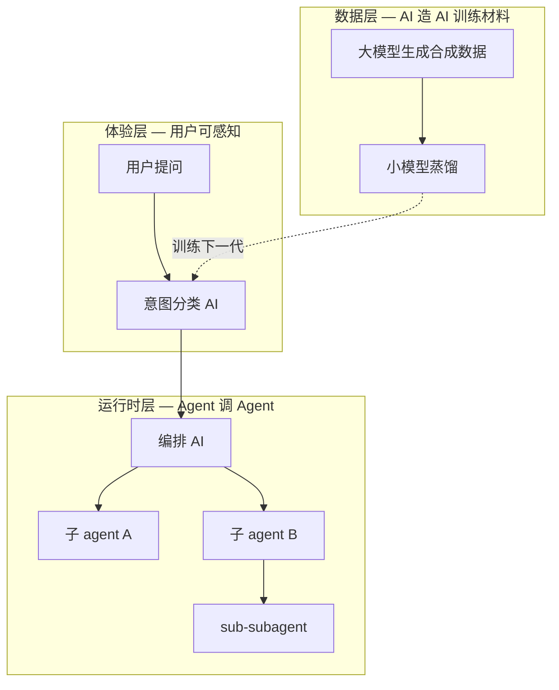

# Figure 01: AI 套娃三层结构

```mermaid
flowchart TD
    subgraph EXP["体验层 — 用户可感知"]
        U["用户提问"]
        I["意图分类 AI"]
        U --> I
    end

    subgraph RT["运行时层 — Agent 调 Agent"]
        O["编排 AI"]
        A["子 agent A"]
        B["子 agent B"]
        S["sub-subagent"]
        O --> A & B
        B --> S
    end

    subgraph DATA["数据层 — AI 造 AI 训练材料"]
        G["大模型生成合成数据"]
        D["小模型蒸馏"]
        G --> D
    end

    I --> O
    D -.->|"训练下一代"| I
```

Caption: 图 1：AI 套娃的三层递归结构 — 体验层 / 运行时层 / 数据层
